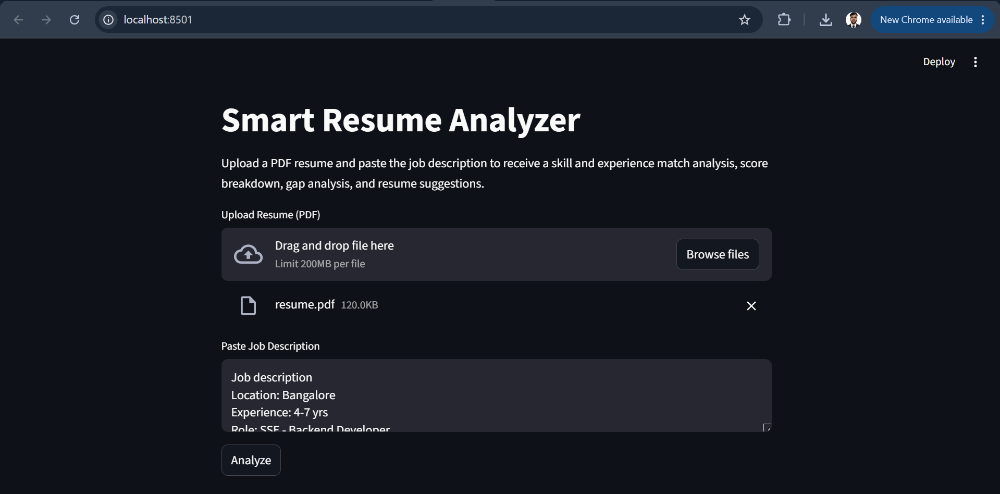
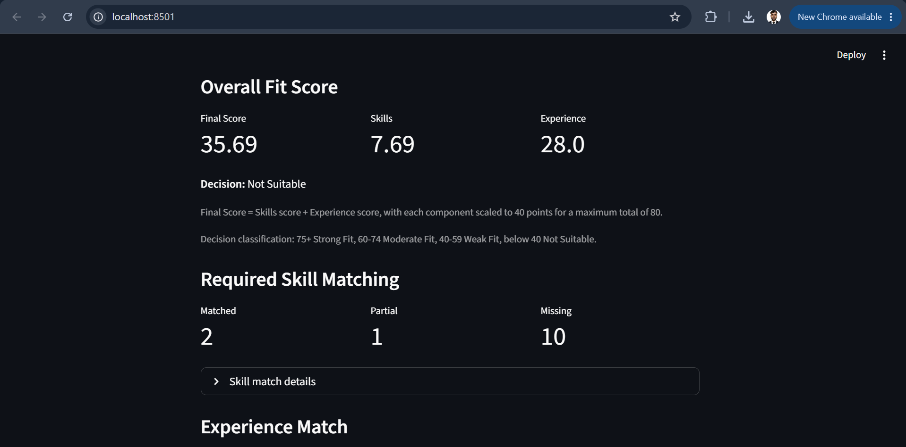
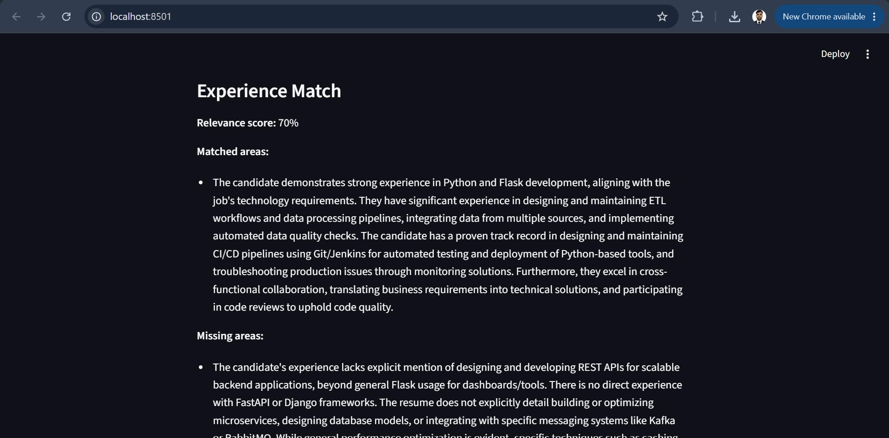
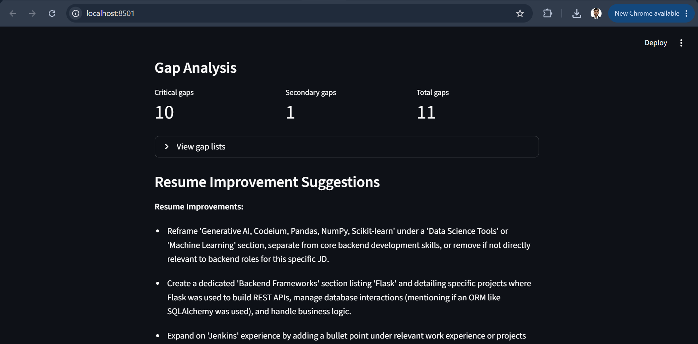
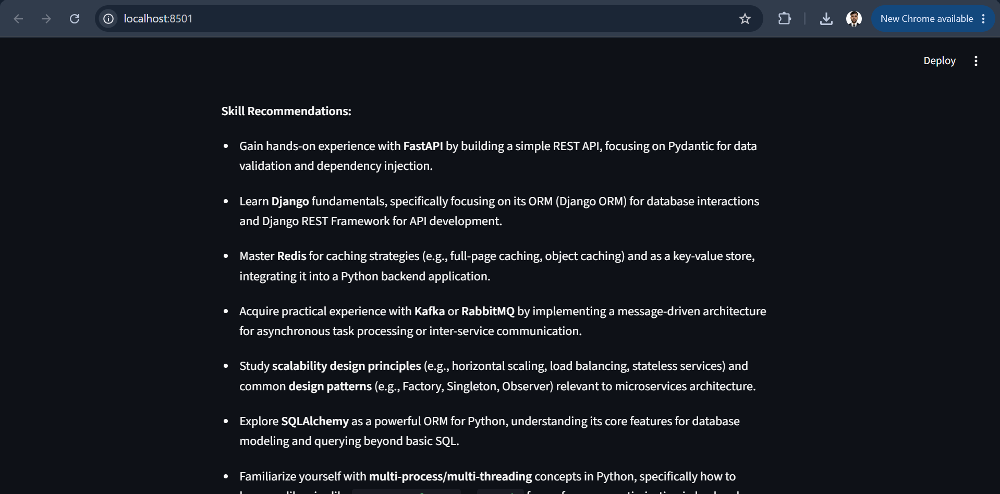
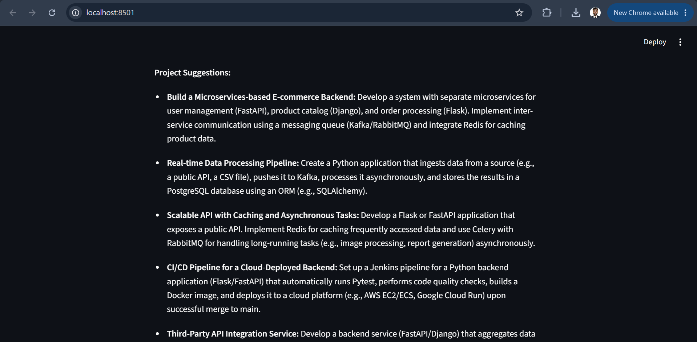

# SmartResumeAnalyzer

SmartResumeAnalyzer is a Streamlit app that extracts resume content, analyzes a job description, matches skills and experience, and presents an overall fit score with gaps and suggestions.

## Features

- Resume parsing from PDF
- Job description analysis and normalization
- Skill and experience matching
- Fit scoring with an overall decision label
- Gap analysis and improvement suggestions
- Streamlit dashboard for reviewing results

## Screenshots

### Upload Resume



### Overall Score



### Experience Match



### Gap Analysis



### Skill Recommendations



### Project Suggestions



## Project Structure

- `main.py` - orchestration entry point
- `pipeline/` - resume and JD processing flows
- `matching/` - skill and experience matching helpers
- `scoring/` - score calculation logic
- `analysis/` - gap analysis and suggestion generation
- `ui/` - Streamlit application and components
- `utils/` - PDF loading, text cleanup, and validation helpers

## Prerequisites

- Python 3.14 or compatible Python 3.x version
- A virtual environment is recommended
- API keys configured in `.env` if required by your LLM setup

## Setup

From the project root:

```powershell
$env:PYTHONPATH="."
```

Install the required packages for the project if they are not already available in your environment.

## Run the App

```powershell
streamlit run ui/app.py
```

## Usage

1. Upload a resume PDF.
2. Paste the job description.
3. Click Analyze.
4. Review the score, skill match, experience match, gaps, and suggestions.

## Notes

- `how_to_run.txt` is kept as a local helper file and is not meant to be committed.
- Generated output files in `data/output/` are ignored from GitHub pushes.